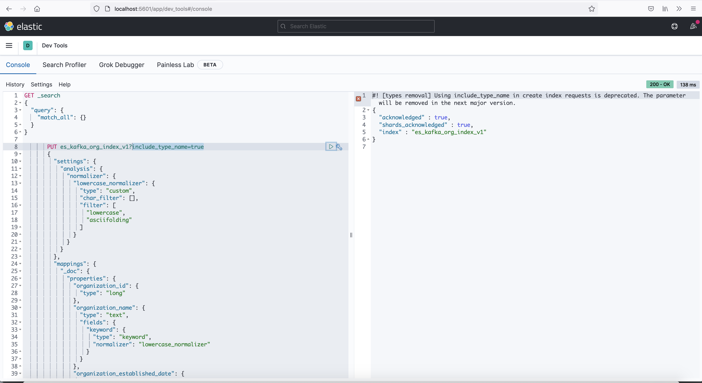

### Introduction
This service has been created to demonstrate the usage of elastic search in spring boot application.
Elastic search is basically used to store large amount of data and get the data in very effective time response.
This service contains the information in regards to add index in elastic search and curd process to update the elastic search index and search the data using elastic search API written in Java.
This service contains a docker compose file which is used to initiate required technical aspects for functionality to work.
Please check the next section for more details.

### Technologies
The repository is built in `Spring Boot` and uses `JPA` to do database processes. 
Kafka has been used as a communication service to update elastic search index with latest add/update/delete operation.
Docker compose initiates following instances:
  * Database
  * Elastic Search
  * Kibana [ES Communication Tool]
  * Kafka
 

### Steps to follow [Pre-request]

 To Remove all the instances from docker:
    
    docker container stop $(docker container ls -aq)
    
    docker container rm $(docker container ls -aq)
    
 Run docker compose file
 
    docker-compose up -d
    
 Run flyway migration script
 
    ./gradlew flywaymigrate
    
 Once flyway migration is successfully done, there would a `Organization` Table created in database.
 Since we have run docker compose file hence all instances present in file would be running,
 Please verify working elastic search through kibana using following URL
 
      http://localhost:5601
 
  
  
 Create Index
  * Go to Dev Tools
  * Copy the following index or copy it from EsIndex.Txt file
     
         PUT es_kafka_org_index_v1?include_type_name=true
         {
           "settings": {
             "analysis": {
               "normalizer": {
                 "lowercase_normalizer": {
                   "type": "custom",
                   "char_filter": [],
                   "filter": [
                     "lowercase",
                     "asciifolding"
                   ]
                 }
               }
             }
           },
           "mappings": {
             "_doc": {
               "properties": {
                 "organization_id": {
                   "type": "long"
                 },
                 "organization_name": {
                   "type": "text",
                   "fields": {
                     "keyword": {
                       "type": "keyword",
                       "normalizer": "lowercase_normalizer"
                     }
                   }
                 },
                 "organization_established_date": {
                   "type": "text"
                 },
                 "organization_type": {
                   "type": "integer"
                 },
                 "organization_status": {
                   "type": "integer"
                 },
                 "organization_is_deleted": {
                   "type": "boolean"
                 }
               }
             }
           }
         }
                  
  * Run it in Kibana
  
     
     
  * Once ES index has been added successfully, Now our application is ready to run

### Run Service
  
  * Run following command to start spring boot application
    
        ./gradlew bootRun
  
  * Make sure the application is running successfully
  
  * Use following curl to add an entry in `Organization` table as well as in elastic search index
        
        curl -X POST 'http://localhost:8080/v1/add' \
        -H 'Content-Type: application/json' \
        -d '{
              "name":"ORG1",
              "type":"ENTERPRISE",
              "establishedDate": 1626376663285
        }'
      
  * Once above mentioned API runs successfully, data must be present in elastic search, Please use following curl to get the data from elastic search
       
        curl -X GET 'http://localhost:8080/v1/es/list' \
        -H 'Content-Type: application/json'
        
  * This service contains other operations as well such as `update` and `delete`, Please check the source code for more information

### Summary    
  Elastic search is basically used to store large data and fast access of data. In this repository, fetching data from elastic search and getting it from DB both APIs are present. 
  Please verify the improvement in search timing by adding bulk data and fetching it from ES and DB and comparing response time.